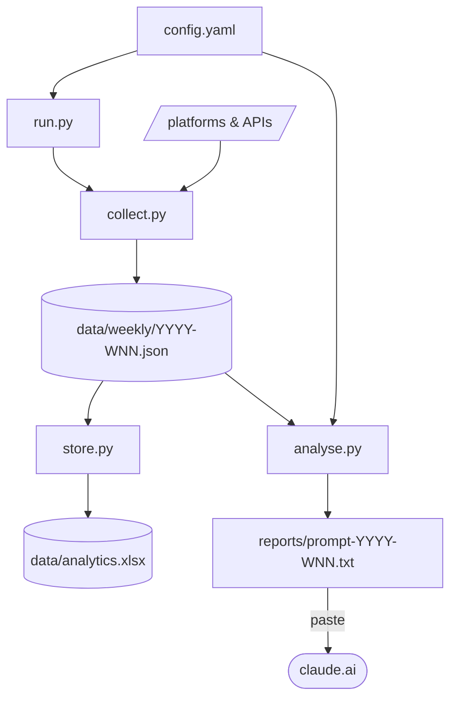

# social-brain

A Python CLI that collects analytics from your social and publishing platforms, then builds a prompt for Claude to produce:

1. **A performance report** — what worked, what didn't, cross-platform patterns, 5 content ideas grounded in your data, and a gap analysis based on your primary focus
2. **An interactive dashboard** — a self-contained React artifact that renders directly in claude.ai, no server needed
3. **A persistent spreadsheet** — `data/analytics.xlsx` accumulates data across runs; new platforms automatically backfill 3 months

---

## Quick start

```bash
git clone https://github.com/you/social-brain
cd social-brain
pip install -r requirements.txt
git config core.hooksPath .githooks   # enables the secret-scanning pre-commit hook
cp config.example.yaml config.yaml
# edit config.yaml — see platform setup below
python run.py
# paste reports/prompt-YYYY-WNN.txt into claude.ai — use Claude Opus for best results
```

---

## Configure your focus

Before adding any platforms, set what matters most to you:

```yaml
# config.yaml
primary_focus: newsletter growth   # or "reach", "book sales", "conversion rate", etc.
```

Claude uses this as the lens for the entire report and recommends specific tools and integrations that would help you measure it better.

---

## Platform setup

Sources are grouped by how much effort they take. Start with the easy ones — you'll get a useful report even with just one or two.

### Zero config (just add your handle/IDs)

**Mastodon** — public API, no token needed
```yaml
mastodon_instance: hachyderm.io
mastodon_handle: alice
```

**Bluesky** — public API, no token needed
```yaml
bluesky_handle: alice.bsky.social
```

**Amazon** — public product pages, no token needed
```yaml
amazon_asins:
  - B0XXXXXXXXXX   # Kindle ASIN
  - 1234567890     # Paperback ISBN-10
amazon_marketplaces:
  - amazon.com
  - amazon.co.uk
```

Collects: bestseller rank, star rating, review count per edition per marketplace.

---

### API key required

**Buttondown**
1. Settings → API keys → create a read-only key
2. Set `buttondown_api_key` in `config.yaml`

Collects: subscriber counts, and per-issue open rate, click rate, unsubscribes. Also picks up scheduled future emails.

**Buffer** (scheduled posts)
1. [buffer.com/manage/apps-and-extras/apps](https://buffer.com/manage/apps-and-extras/apps) → generate a personal access token
2. Set `buffer_token` in `config.yaml`

Collects: all queued posts across connected channels — shown to Claude as upcoming content so it suggests complementary ideas.

**GoatCounter**
1. [goatcounter.com](https://www.goatcounter.com) → create an account and site
2. Add the tracking script to your site's `<head>`:
   ```html
   <script data-goatcounter="https://yoursite.goatcounter.com/count"
       async src="//gc.zgo.at/count.js"></script>
   ```
3. Settings → API → Create token (read access)
4. Set `goatcounter_site` (just the subdomain, e.g. `what-raccoon`) and `goatcounter_token` in `config.yaml`

To track custom events (e.g. quiz results), call `window.goatcounter.count()` with `event: true` in your JS.

Collects: total pageviews, unique visitors, and per-path breakdown (including custom events).

**Vercel Web Analytics**

Your project must have Web Analytics enabled. You need at least Member access on the team.

1. [vercel.com/account/tokens](https://vercel.com/account/tokens) → Create token (Full Account scope)
2. Set `vercel_token`, `vercel_project_id` (project slug from the URL), and `vercel_team_id` (from Team Settings → General, if applicable)

---

### Requires a manual export

**LinkedIn**

LinkedIn doesn't offer an analytics API for individual creators.

1. LinkedIn profile → Analytics → Posts → Export → download CSV/XLSX
2. Move the file into `linkedin_drops/`

The most recently modified file in that folder is used each run. Post text is fetched automatically from each post's public URL.

**Substack**

1. Substack dashboard → Stats → Emails → Export → download CSV
2. Move the file into `substack_drops/`

Expected columns: `Date`, `Subject`, `Recipients`, `Opens`, `Open rate`, `Clicks`, `Click rate`, `Unsubscribes`.

---

### More involved setup

**Jetpack / WordPress.com Stats**

Your site must have Jetpack active with Stats enabled.

1. [developer.wordpress.com/apps](https://developer.wordpress.com/apps/) → create an app (Type: Native, Redirect URL: `http://localhost`)
2. Exchange credentials for a token (use your WordPress.com username, not email):
   ```bash
   curl -X POST https://public-api.wordpress.com/oauth2/token \
     -d "client_id=YOUR_CLIENT_ID" \
     -d "client_secret=YOUR_CLIENT_SECRET" \
     -d "grant_type=password" \
     -d "username=YOUR_WP_USERNAME" \
     -d "password=YOUR_WP_PASSWORD"
   ```
3. Set `jetpack_access_token` and `jetpack_site` (e.g. `yourdomain.com`) in `config.yaml`

Collects: daily page views, top posts, referrer sources, and scheduled future posts.

**Google Search Console**

Gives you the search queries that bring people to your site and which pages they land on.

1. [Google Cloud Console](https://console.cloud.google.com/) → enable the **Google Search Console API**
2. Create a Service Account → generate a JSON key → download it
3. In [Search Console](https://search.google.com/search-console), add the service account email as a **Full user** on each property
4. Set `gsc_credentials_file: /path/to/service-account.json` in `config.yaml`
5. Install extra dependencies: `pip install google-api-python-client google-auth`

---

### Optional add-ons (extend existing credentials)

**Mastodon @mentions** — set `mastodon_access_token`
1. Settings → Development → New Application → enable `read:notifications` scope only
2. Copy the access token into `config.yaml`

**Bluesky @mentions** — set `bluesky_app_password`
1. Settings → Privacy and Security → App Passwords → create one (not your main password)
2. Set `bluesky_app_password` in `config.yaml`

**Hacker News mentions** — automatic, no config needed
Just set `monitored_domains` and HN is searched automatically via the Algolia API.

```yaml
monitored_domains:
  - yourdomain.com
  - yourotherdomain.com
```

---

## Usage

```bash
python run.py                    # collect all platforms + build prompt
python run.py --months 3         # longer lookback window
python run.py --collect-only     # collect and store data, skip prompt
python run.py --analyse-only     # build prompt from last saved data
python run.py --platform mastodon  # single platform
```

Paste `reports/prompt-YYYY-WNN.txt` into claude.ai to get the report and dashboard. Use **Claude Opus** — it handles the cross-platform analysis and React artifact generation significantly better than Sonnet.

If you haven't run in more than two weeks, the lookback window is automatically extended to cover the gap — no manual `--months` needed.

---

## Persistent data store

Every run updates `data/analytics.xlsx` — a multi-sheet spreadsheet that accumulates data over time:

- **Upsert semantics**: existing rows are updated if the underlying data changed (e.g. a post gains more likes)
- **Automatic backfill**: when a new platform is first detected, 3 months of data are collected and stored
- The file is gitignored and stays local

---

## Architecture



---

## Project structure

```
social-brain/
├── config.example.yaml   # template — copy to config.yaml and fill in your keys
├── config.yaml           # your real config — gitignored
├── collect.py            # data collectors
├── analyse.py            # prompt builder
├── store.py              # analytics.xlsx upsert logic
├── run.py                # CLI entry point
├── prompts/              # editable prompt templates (preamble.txt, suffix.txt)
├── viz/Dashboard.jsx     # reference template Claude models the artifact on
├── tests/                # pytest test suite — no real credentials needed
├── data/                 # raw JSON snapshots + analytics.xlsx (gitignored)
├── reports/              # generated prompt files (gitignored)
├── linkedin_drops/       # drop LinkedIn exports here
└── substack_drops/       # drop Substack exports here (gitignored)
```

Run the tests locally with:

```bash
pip install pytest pytest-timeout respx google-api-python-client google-auth
pytest tests/
```

Tests run automatically on every push and pull request to `main` via GitHub Actions.

---

## Automating weekly runs

```cron
0 8 * * 1 cd /path/to/social-brain && python run.py >> logs/cron.log 2>&1
```

---

## Privacy and security

**What stays local:** `config.yaml`, `data/`, `reports/`, `linkedin_drops/`, `substack_drops/`, `data/analytics.xlsx` — all gitignored.

**What leaves your machine:** The prompt (including your collected analytics) is sent to Claude via claude.ai — the same as any prompt you type. Credentials are sent only to their respective platform APIs.

**Pre-commit hook:** `.githooks/pre-commit` scans staged files for credential-shaped strings before allowing a commit. Activate once with:
```bash
git config core.hooksPath .githooks
```
